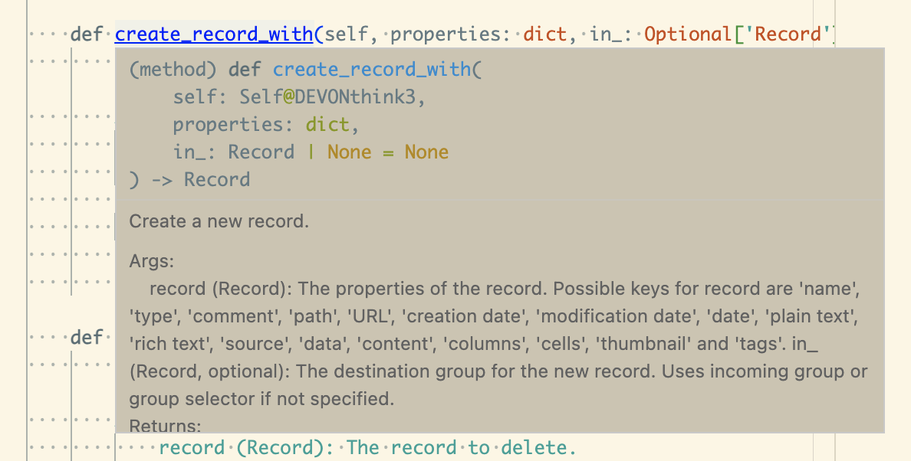

# PyDT3 - The Python API For DEVONthink 3

The Python API for Devonthink 3 utilizes AppleScript (JXA) and PyObjC.

Most of the APIs are directly mapped to AppleScript (JXA).
For example, these two are equivalent:

```python
from pydt3 import DEVONthink3
dt3 = DEVONthink3()
for db in dt3.databases:
    print(db.name)
```

```applescript
tell application "DEVONthink 3"
    repeat with db in databases
        log name of db as string
    end repeat
end tell
```

Many of the APIs are generated with help of ChatGTP 3.5 from the AppleScript dictionary of DEVONthink 3.

The Applescript bridging part is inspired by [py-applescript](https://github.com/rdhyee/py-applescript).

## Installation

```bash
pip install pydt3
```

## Quick Start

```python
from pydt3 import DEVONthink3
dtp3 = DEVONthink3()

inbox = dtp3.inbox

# create a new folder in inbox
dtp3.create_location('new-group-from-pydt3', inbox)

# get selected records
records = dtp3.selected_records

# get the first selected record and print its information
if records:
    first = records[0]
    print(first.name)
    print(first.type)
    print(first.reference_url)
    print(first.plain_text)

# create record in inbox
record = dtp3.create_record_with({
    'name': 'hello-from-pydt3',
    'type': 'markdown',
    'plain text': '# Hello from pydt3',
}, inbox)
```

## Documentation

Unlike many other API wrapper projects, PyDT3 is well documented thanks to the detailed AppleScript dictionary by DEVONthink team and the code generation ability of ChatGTP.

You can check the documentation either in source code (`docstring`), code editor (if properly configured), or the documentation site (not available at the time).



## Requirements

- DEVONthink 3
- Python 3.6+
- PyObjC

## Limitations

- The APIs are not fully tested. Please report any issues.
- Rich texts in AppleScript are converted to strings in Python, which causes style information loss.
- Collections of elements (eg. `database.records`) are converted to lists in Python. While in Applescript they are retrieved in a lazy manner. This may cause performance issues with large collections.
